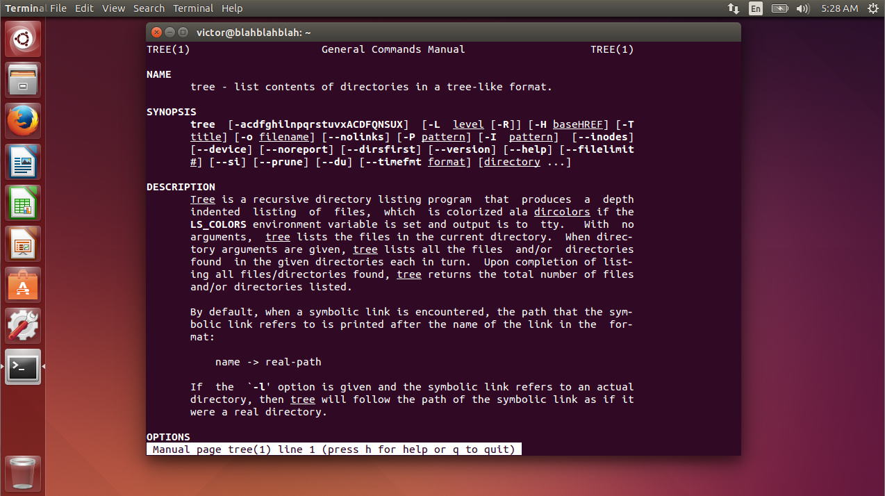
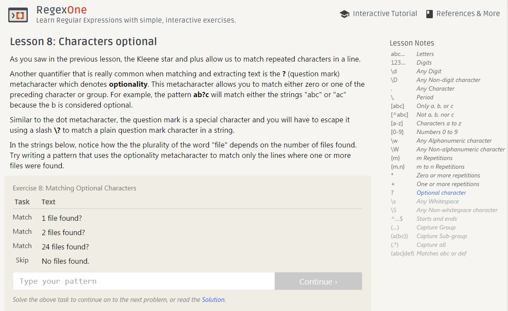
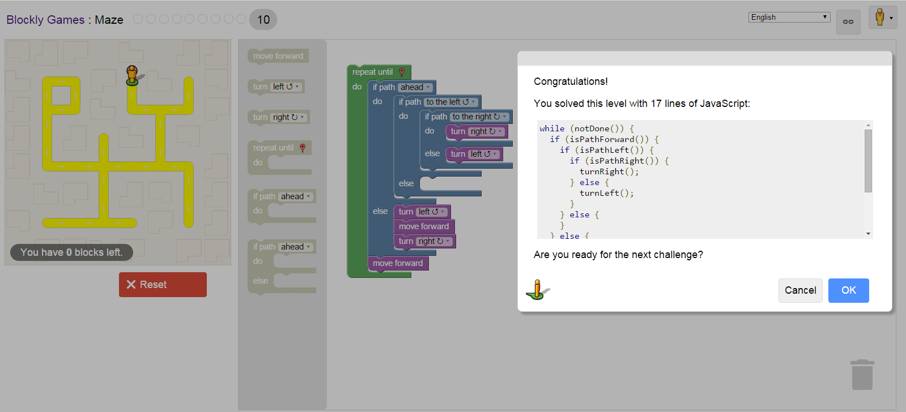

## [Lab 1](http://rcos.github.io/CSCI2963-01/?content=labs&mode=details&page=Labs%2FLab1.Md&sha=76e49f001586361c8469430d13445be4cc2876a7) Reading Reflection

##### C. Reading Assignment
1. Please read the 10 criteria of Open Source Definition http://opensource.org/osd and understand why they are important.

2. Please read Eric Raymond's article [Smart Questions](http://www.catb.org/esr/faqs/smart-questions.html) How to ask the question The Smart Way . 
    - Do you have more suggestions for How To Answer Questions in a Helpful Way (from your past experience) http://www.catb.org/esr/faqs/smart-questions.html#idp64834912 
    - List at least two.


Eric Raymond's article gives a very good example on how to construct a good subject header, using the form “object - deviation”, here is the 3 cases he gives:

```
Stupid:
HELP! Video doesn't work properly on my laptop!

Smart:
X.org 6.8.1 misshapen mouse cursor, Fooware MV1005 vid. chipset

Smarter:
X.org 6.8.1 mouse cursor on Fooware MV1005 vid. chipset - is misshapen
```

<br>
###### Do you have more suggestions for How To Answer Questions in a Helpful Way? (from your past experience)

- One thing I found very important is that make sure and double check if you understand what people is really asking. The question may seem simple and straight-forward at a glance, if you are not sure, always ask to clarify first in order to better help people.


- Be respectful, enthusiastic.

<br>
##### D. Linux
man tree screenshot:




<br>
##### E. Regex
Regex lv.8 screenshot:




<br>
##### F. Play Blockly




<br>
##### G. Reflection

I would like to start with finding project on Github explorer and also reviewing my starred and watched projects. Both web front-end and back-end projects don't normally interest me, so I am thinking anything but web for now.