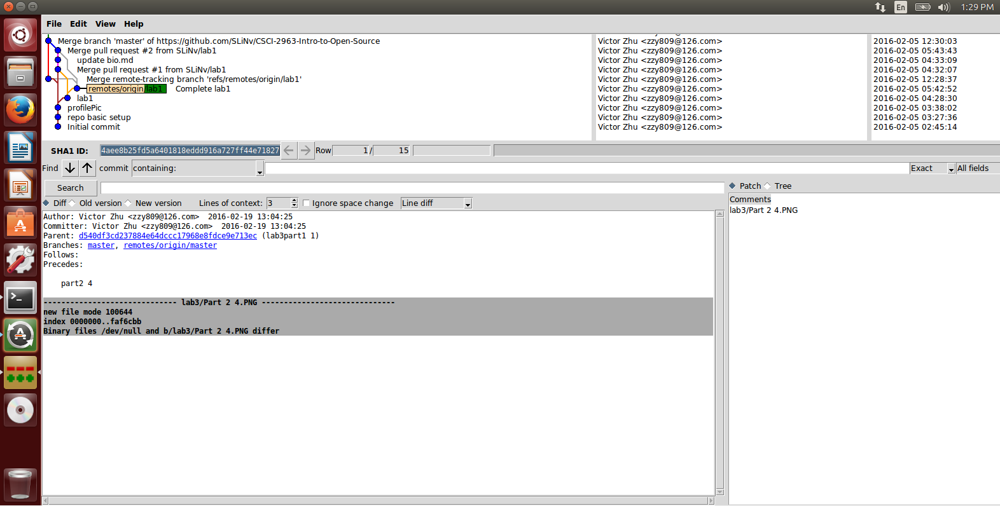
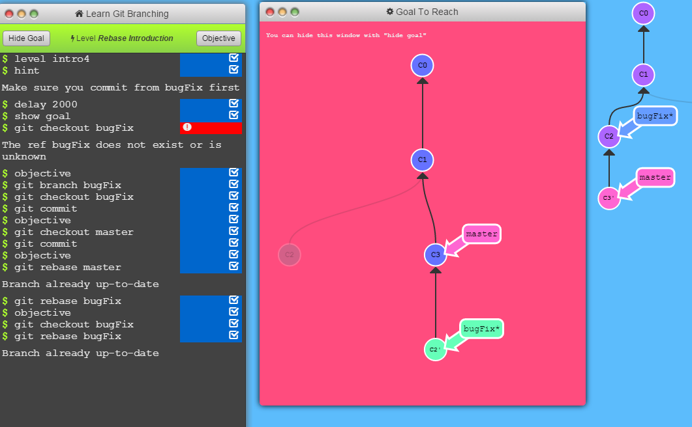

## [Lab 3](http://rcos.github.io/CSCI2963-01/?content=labs&mode=details&page=Labs%2FLab3.Md&sha=e925618ef65aaa533a47f5d4634c1e37a5f76f13) Git

### Part 1 

[lab3part1](https://github.com/SLiNv/lab3part1)

### Part 2

### Part 3

[courseproject repo](https://github.com/SLiNv/courseproject)

[NewStory-olivierpo](https://github.com/olivierpo/NewStory)
