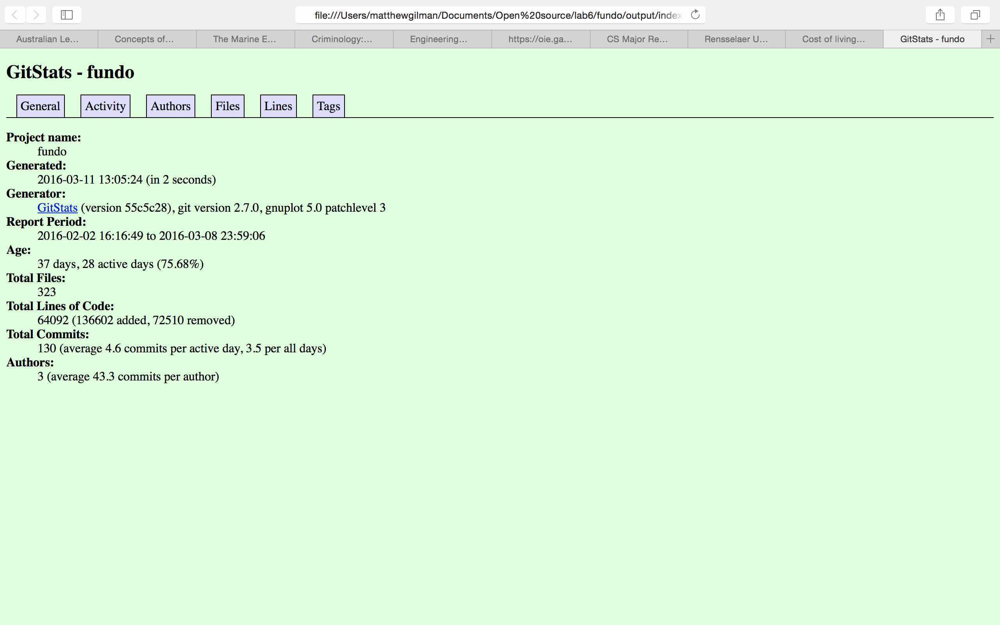
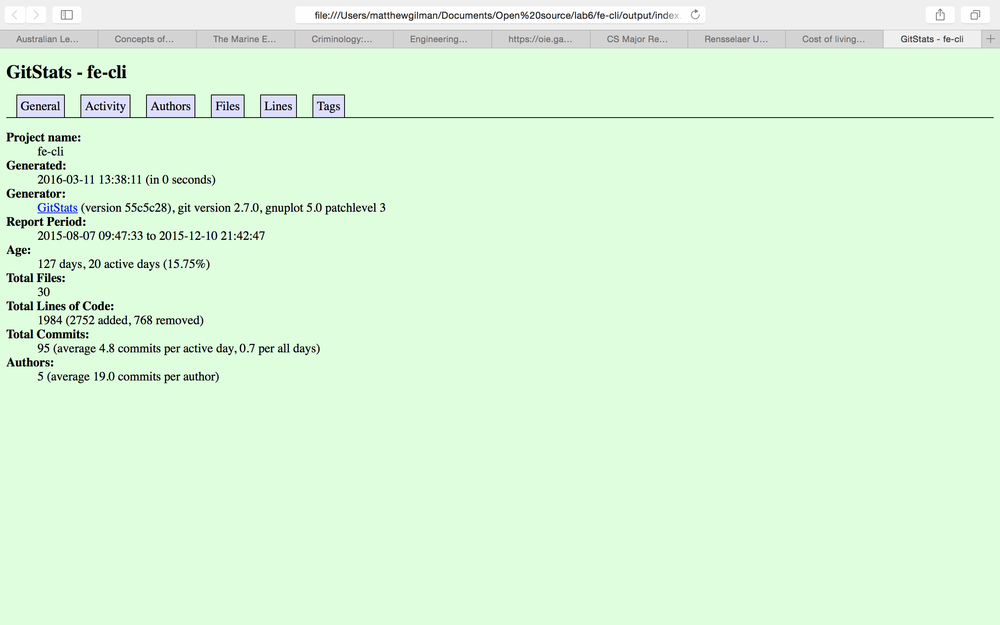
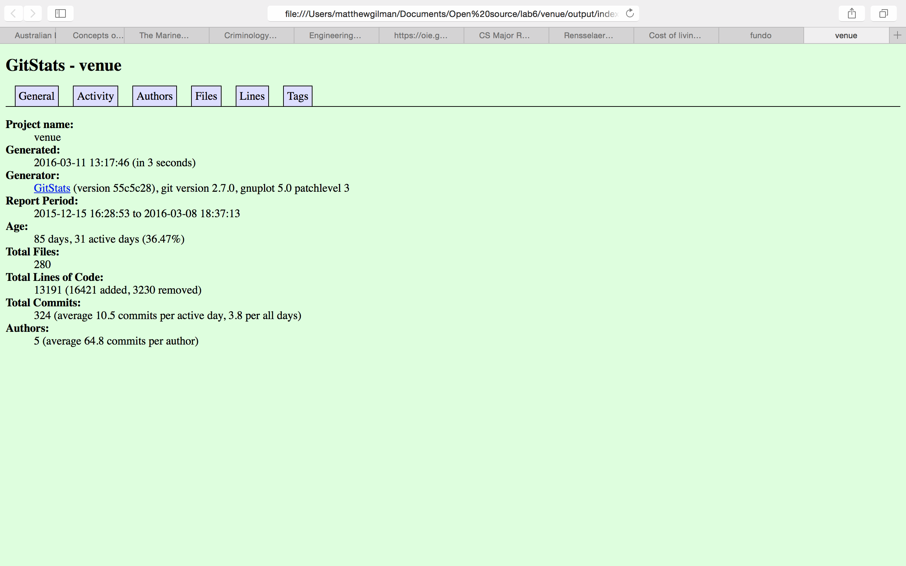
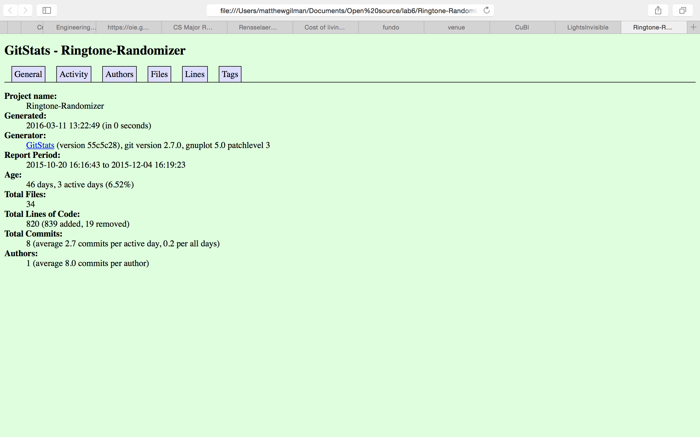
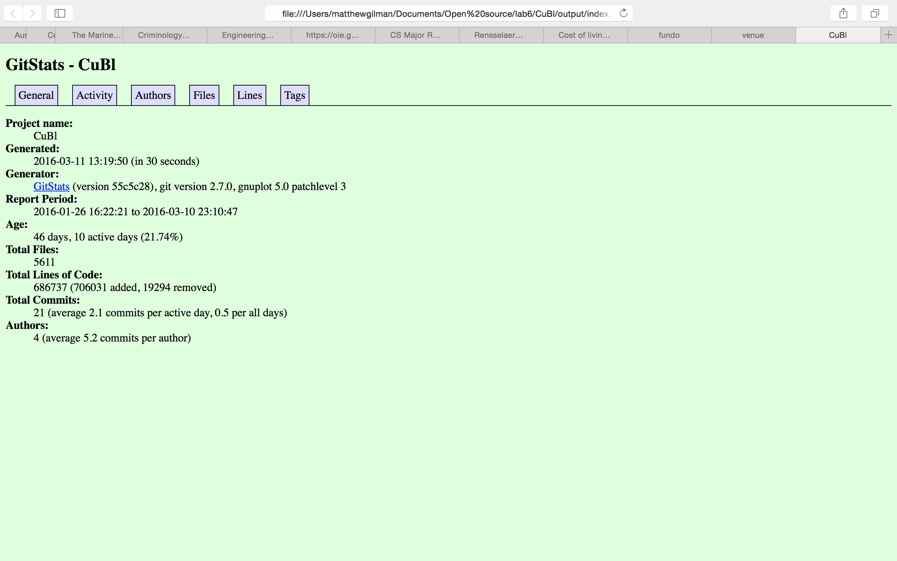

## [Lab 6](http://rcos.github.io/CSCI2963-01/?content=labs&mode=details&page=Labs%2FLab6.Md&sha=971988266f2fd9b05d33c07bd32dcb009861d58f) ommunity Development and Unit Testing

###Part 1 - Community

####1+2. Project selection + Giststats

#####Fundo:

Contributors: 3
number of lines of code: 66495
First Commit: January 31 2016
Latest Commit: March 8, 2016
Current branches: 1

Gitstats:

#####Fe-cli
Contributors: 1 
number of lines of code: 3714
First Commit: October 26, 2015
Latest Commit: December 10, 2016
Current branches: 1

Gitstats:

#####Venue
Contributors: 4
number of lines of code: 15515
First Commit: December 15 2015
Latest Commit: March 8, 2016
Current branches: 3

Gitstats:

#####Ringtone-Randomizer
Contributors: 1
number of lines of code: 1186
First Commit: October 20, 2015
Latest Commit: December 10, 2016
Current branches: 1

Gitstats:

#####Cubl
Contributors: 2
number of lines of code: 122875
First Commit: 
Latest Commit: 
Current branches:

Gitstats:

####3.Streaming Contribution Visualizations

Cubl: https://youtu.be/yDnqUu07QlE
Leader: Wyler McAninch-Ruenzi

Fe-Cli:https://youtu.be/D2HUIF-Ehms
Leader:Kevin Zhang

Fundo: https://youtu.be/1jhqha5UJBQ
Leader: Lucas Silva

Ringtone-Randomizer: https://youtu.be/vNk2pYIXBzw
Leader: Cordom2

Venue: https://youtu.be/YQuVC4O2qyE
Leader: Severin Ibarluzea

 

###Part 2
[Part2 click here](lba6/part2)
